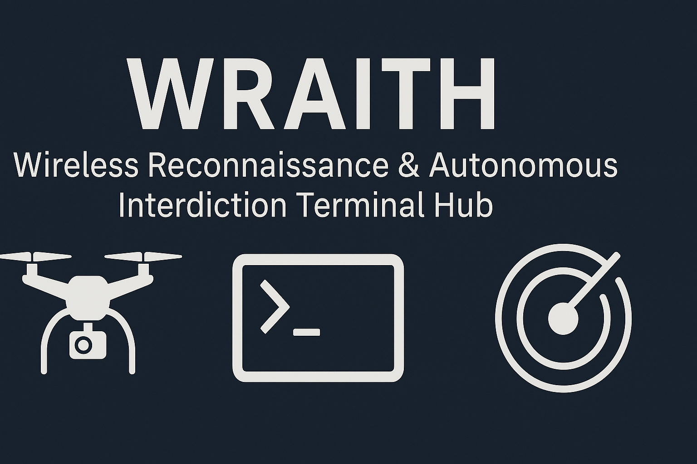

# WRAITH  
**Wireless Reconnaissance & Autonomous Interdiction Terminal Hub**

---

### 📡 Overview

**WRAITH** is a research-oriented, field-deployable tool designed to highlight risks associated with unencrypted UAV telemetry links that use the MAVLink protocol. It passively monitors for MAVLink heartbeat messages and, upon detection, can autonomously execute predefined scripts for simulation or training purposes in explicitly authorized environments.

WRAITH was developed to support ethical security research, red team training, and system hardening exercises where telemetry encryption is absent or weak. It does not interact with encrypted traffic, perform denial-of-service attacks, or target commercial systems.

---

### 🧰 Core Features

- Passive MAVLink heartbeat detection
- Autonomous payload scripting (via Python)
- Real-time .log file creation for event tracking
- Headless operation with systemd auto-start
- Discord webhook integration for push alerts (optional)
- Runs within Python virtual environment for isolation

---

### 📁 Project Structure

```
/wraith/
├── launch_wraith.py                # Simple launcher script
├── requirements.txt                # Python dependencies
└── mav_hunter/
    ├── hunter_listener.py          # Main detection and logging engine
    ├── mavlink_payload_cli.py      # CLI tool for simulating payloads
    └── logs/
        └── sample_log.txt          # Example output
```

---

### ⚙️ Setup & Usage

#### Install Python Dependencies

```bash
pip install -r requirements.txt
```

#### Run the Listener

```bash
python3 launch_wraith.py
```

This will start passive monitoring. Logs will appear in:
```
~/mav_hunter/logs/
```

#### Simulate Payloads (Dry Run)

```bash
python3 mav_hunter/mavlink_payload_cli.py --spoof --reboot --dry-run
```

---

### 🧪 Testing with QGroundControl

- Set up a UDP link in QGroundControl:
  - Port: 14551
  - Target: `<Your Pi IP>:14550`
- Start a drone or simulator sending telemetry
- WRAITH will log heartbeats and simulate payloads

---

### 📸 Screenshots

> _Replace these with actual clean screenshots when available_

- Virtualenv activated
- Listener script running
- Simulated payloads triggered
- Discord alert example (optional)

---

### 🚧 Future Upgrades

- Target filtering (system ID/firmware type)
- Payload delays and conditional triggers
- MAVLink over serial UART
- UI dashboard for log parsing

---

### ⚠️ Legal + Ethical Disclaimer

WRAITH is intended for **authorized security research, academic training, and red team simulation** only.  
It must **never** be used to target, interfere with, or disrupt real-world systems unless you have **explicit, written permission** from the system owner.

Misuse may violate **local, state, or federal laws**, including U.S. FCC and FAA regulations.

Use responsibly. Train ethically. Document legally.

---

### 📎 Attribution

WRAITH uses [pymavlink](https://github.com/ArduPilot/pymavlink), developed by the ArduPilot and Dronecode communities.  
This project is not affiliated with or endorsed by PX4, Dronecode, ArduPilot, or any other organization.

Linux OS provided by [Kali Linux](https://www.kali.org/).  
Created and maintained by Ryan Schwarz.

Licensed under the [MIT License](LICENSE).
